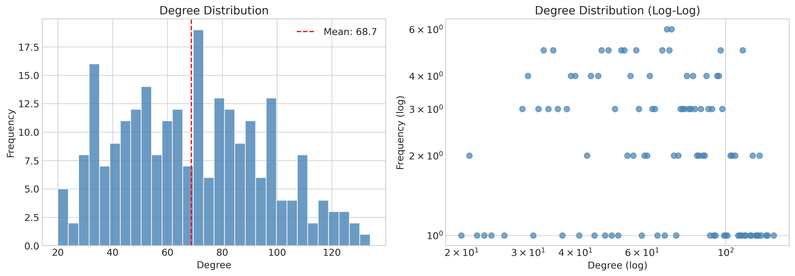
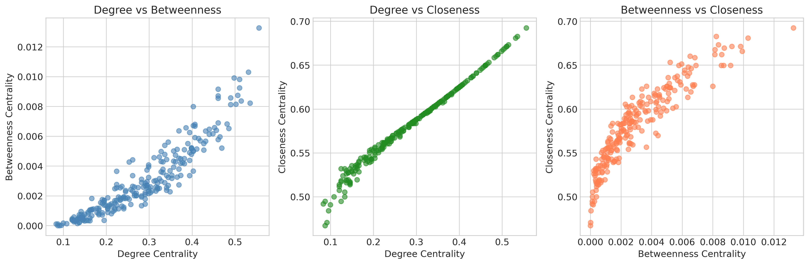
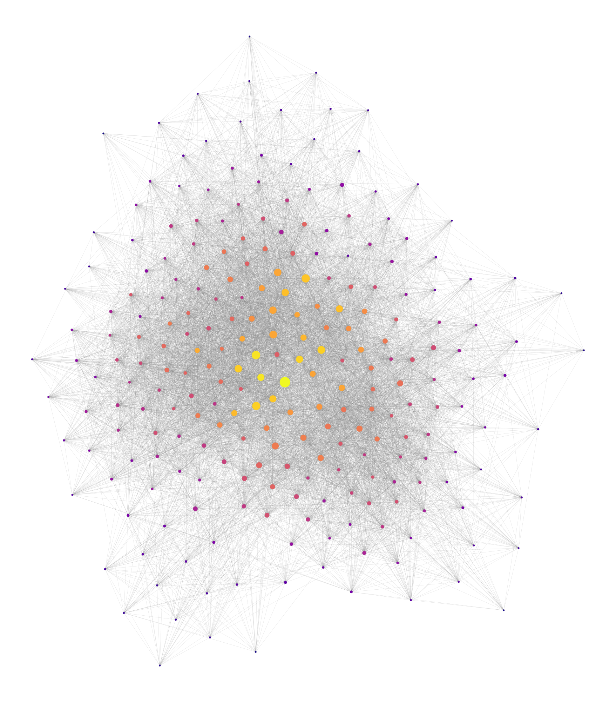
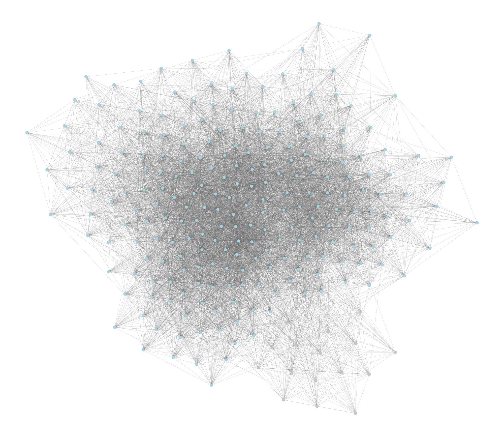
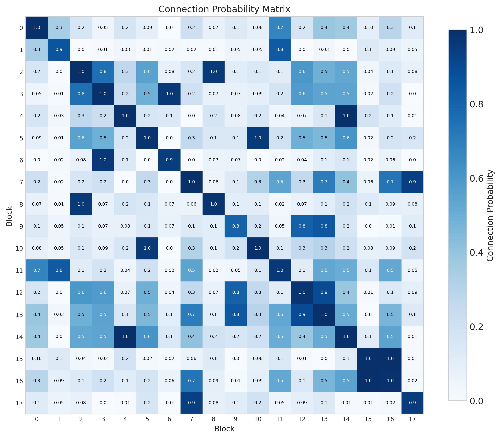
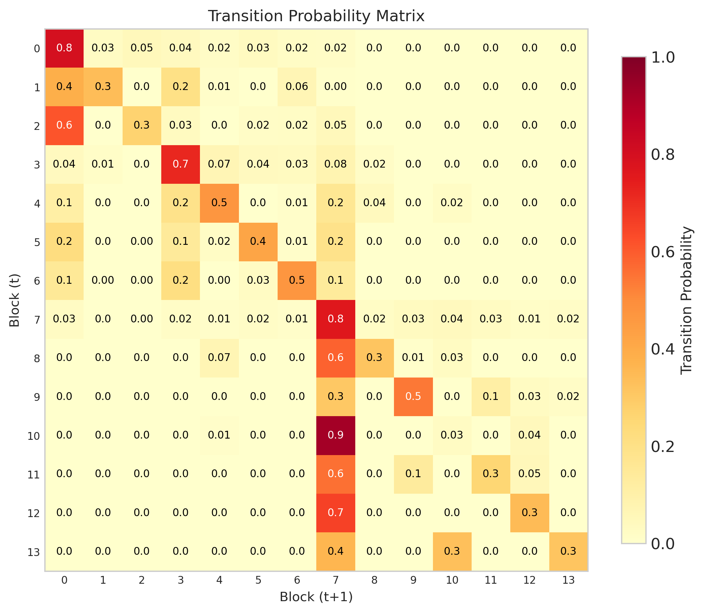
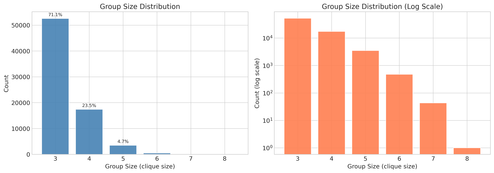
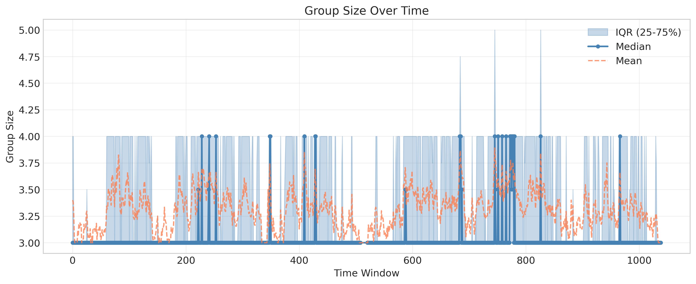

# Temporal Network SBM

[](https://www.python.org/)
[](LICENSE)
[](https://graph-tool.skewed.de/)

A comprehensive Python toolkit for analyzing **temporal (dynamic) networks** using **Stochastic Block Models (SBM)** and **hypergraph group extraction**.

This project was developed as an examination work for the course Network Data Analysis taught by Prof. Maria Francesca Marino at the University of Florence, within the Master's program in Data Science and Statistical Learning MD2SL.

The toolkit implements rigorous statistical methods for network community detection, combining classical network analysis with modern inference-based approaches. It also includes an optional hypergraph analysis module that extracts group interactions via maximal clique enumeration, following the methodology of Iacopini et al. (2022). The complete pipeline transforms raw temporal edge data into publication-quality visualizations and comprehensive statistical reports.


---

## Table of Contents

1. [Features](#features)
   - [Static Network Analysis](#static-network-analysis)
   - [Stochastic Block Model (SBM)](#stochastic-block-model-sbm)
   - [Dynamic Stochastic Block Model](#dynamic-stochastic-block-model)
   - [Hypergraph Group Extraction (Cliques)](#hypergraph-group-extraction-cliques)
   - [Visualization Suite](#visualization-suite)
2. [Installation](#installation)
3. [Quick Start](#quick-start)
4. [Input Data Format](#input-data-format)
5. [Output](#output)
6. [Example: LyonSchool Dataset](#example-lyonschool-dataset)
7. [Configuration](#configuration)
8. [Theoretical Background](#theoretical-background)
9. [References](#references)
10. [Acknowledgments](#acknowledgments)
11. [License](#license)

---

## Features

This toolkit provides a comprehensive suite of network analysis methods, structured around three principal pillars: static network analysis, stochastic block model inference, and temporal dynamics. Each component has been designed to offer rigorous statistical foundations whilst maintaining computational efficiency and ease of use.

### Static Network Analysis

The foundation of any network analysis begins with a thorough understanding of basic structural properties. The toolkit computes global statistics including the number of nodes, edges, network density, and the identification of connected components. Distance metrics such as network diameter and average path length provide insight into the overall navigability of the graph. Degree analysis encompasses the full distribution of node degrees alongside summary statistics including mean, standard deviation, minimum, maximum, and median values.

Clustering behaviour is assessed through both the local clustering coefficient and the global transitivity measure, offering complementary perspectives on triadic closure within the network. The toolkit further implements a comprehensive suite of centrality measures: degree centrality captures immediate connectivity, betweenness centrality quantifies the extent to which nodes lie on shortest paths between others, closeness centrality measures the average distance from each node to all others, and eigenvector centrality identifies nodes connected to other well-connected nodes. Finally, network centralisation is computed using Freeman's index, which quantifies the extent to which the network structure is dominated by a single node or small group of nodes.

### Stochastic Block Model (SBM)

Moving beyond heuristic community detection methods, this toolkit employs principled Bayesian inference for network partitioning. The optimal number of blocks is determined automatically through the **Minimum Description Length (MDL)** criterion, which balances model complexity against goodness of fit. Nodes are assigned to blocks via a hard partition derived from the maximum a posteriori (MAP) estimate obtained through Markov Chain Monte Carlo (MCMC) inference.

The inter-block connection probability matrix Π characterises the propensity for edges to form between and within blocks, whilst internal block density analysis reveals the cohesiveness of each community. For comparison with alternative model selection criteria, the **Integrated Classification Likelihood (ICL)** is also computed.

### Dynamic Stochastic Block Model

For temporal networks, the toolkit implements a sliding-window approach inspired by the `dynsbm` methodology. Temporal data are partitioned into overlapping time windows, with an independent SBM fitted to each snapshot. A critical challenge in this setting is the correspondence problem: block labels are arbitrary within each window, making direct comparison across time points problematic. This is addressed through **label alignment** using the Hungarian algorithm, which finds the optimal permutation of labels to maximise consistency between consecutive windows.

The aligned block assignments enable the computation of a **transition probability matrix** $P(b_{t+1} | b_t)$, which characterises how nodes move between communities over time. Block stability metrics quantify the persistence of community structure, whilst the identification of **mobile nodes**—those individuals who frequently change block membership—reveals the dynamic core of the network.

### Hypergraph Group Extraction (Cliques)

Many real-world social interactions involve more than two individuals simultaneously. Whilst temporal edge lists record only pairwise contacts, it is possible to approximate **higher-order group interactions** by extracting cliques from aggregated time windows, following the methodology of Iacopini et al. (2022).

The underlying rationale is straightforward: within a given time window, if individuals A, B, and C all interact pairwise (A↔B, B↔C, A↔C), they have likely participated in a group interaction. This pattern corresponds to a clique—that is, a complete subgraph—in the contact network. The toolkit extracts **maximal cliques** from each time-window snapshot, where each clique of size k represents a k-person group interaction, or equivalently, a hyperedge of order k. From these extractions, the distribution of group sizes across all windows is computed, and the temporal evolution of group sizes is tracked throughout the observation period.

This analysis is optional and may be enabled with the `--hypergraph` flag.

### Visualisation Suite

All analyses are accompanied by publication-ready visualisations designed to communicate results effectively. For degree analysis, both linear and log-log scale distributions are produced. Centrality measures are presented through comparison scatter plots alongside network graphs where node sizes reflect centrality values. The SBM results are visualised through community structure diagrams and block connection probability heatmaps.

Temporal aspects of the data are captured through activity timelines, whilst the dynamic SBM results are presented via transition heatmaps and block evolution plots. When hypergraph analysis is enabled, additional figures display the group size distribution and the temporal trajectory of group sizes (median and interquartile range per window). An optional animated network evolution visualisation is also available, with configurable resolution settings.

Further details regarding output filenames may be found in the [Output](#output) section below.

---

## Installation

### System Requirements

- **Python 3.8+**
- **Linux or WSL** (Windows Subsystem for Linux) — required for graph-tool
- 4GB RAM recommended for large networks

### Step 1: Install graph-tool

The core of this toolkit relies on `graph-tool`, a highly efficient C++ library for network analysis. It cannot be installed via pip.

**Conda (recommended — works reliably on Linux, macOS, and WSL)**
```bash
conda create -n netsbm python=3.10
conda activate netsbm
conda install -c conda-forge graph-tool
```

**Alternative: Ubuntu/Debian via apt (may require additional configuration)**
```bash
sudo apt update
sudo apt install -y software-properties-common
sudo add-apt-repository universe
sudo apt update
sudo apt install python3-graph-tool
```
> ⚠️ The `apt` method may fail on some Ubuntu versions. If you encounter issues, use Conda instead.

**Docker (containerized)**
```bash
docker pull tiagopeixoto/graph-tool
docker run -it tiagopeixoto/graph-tool python3
```

### Step 2: Install Python dependencies

With your conda environment activated:

```bash
conda activate netsbm
pip install -r requirements.txt
```

`requirements.txt` includes NumPy, SciPy, Matplotlib, pandas, PyYAML, and NetworkX (used for clique enumeration in hypergraph analysis).

> ⚠️ **Important**: Always install packages inside the activated conda environment. Do not use `sudo` with pip or conda.

### Step 3: Clone this repository

```bash
git clone https://github.com/battles5/temporal-network-sbm.git
cd temporal-network-sbm
```

### Windows Users (WSL)

This toolkit requires **WSL** (Windows Subsystem for Linux):

1. Open PowerShell as Administrator and run: `wsl --install`
2. Install Ubuntu from Microsoft Store (22.04 or 24.04)
3. Inside WSL, install Miniconda and then graph-tool via conda-forge:
   ```bash
   wget https://repo.anaconda.com/miniconda/Miniconda3-latest-Linux-x86_64.sh
   bash Miniconda3-latest-Linux-x86_64.sh
   conda create -n netsbm python=3.10
   conda activate netsbm
   conda install -c conda-forge graph-tool
   ```
4. Run the toolkit from within WSL

---

## Quick Start

### Dataset

> **Note**: This repository does not include datasets. Download a temporal network dataset before running the analysis.

**Recommended: LyonSchool (primary school face-to-face contacts)**
- [SocioPatterns: Primary School Dataset](http://www.sociopatterns.org/datasets/primary-school-temporal-network-data/)
- [Netzschleuder: sp_primary_school](https://networks.skewed.de/net/sp_primary_school)

Other compatible datasets: SFHH, InVS, Thiers, Hospital (all from [SocioPatterns](http://www.sociopatterns.org/datasets/)).

**Setup**: Create the `data/` folder and place your downloaded dataset there:

```bash
mkdir -p data
# Place the downloaded dataset here, e.g.:
# data/tij_LyonSchool.dat
```

The toolkit expects a simple edge list format:
```
timestamp  node1  node2
0          1      2
0          2      3
20         1      3
...
```

### Basic Usage

```bash
python main.py --input <data_file> --output <output_dir>
```

### Example Commands

```bash
# Run analysis on LyonSchool (download from SocioPatterns first)
python main.py --input data/tij_LyonSchool.dat --output output/

# With custom configuration
python main.py --input data/mydata.dat --output output/ --config my_config.yaml

# Generate network animation (resource-intensive)
python main.py --input data/mydata.dat --output output/ --animate

# Skip dynamic SBM for faster execution
python main.py --input data/mydata.dat --output output/ --no-dynamic-sbm

# Enable hypergraph group extraction (clique analysis)
python main.py --input data/mydata.dat --output output/ --hypergraph

# Hypergraph with custom group size limits
python main.py --input data/mydata.dat --output output/ --hypergraph --min-group-size 4 --max-group-size 15
```

### Command Line Arguments

| Argument | Short | Description |
|----------|-------|-------------|
| `--input` | `-i` | Path to input data file (required) |
| `--output` | `-o` | Path to output directory (required) |
| `--config` | `-c` | Path to YAML configuration file |
| `--animate` | | Generate network animation (MP4/GIF) |
| `--no-dynamic-sbm` | | Skip dynamic SBM analysis |
| `--hypergraph` | | Enable hypergraph group extraction via cliques |
| `--min-group-size` | | Minimum clique size (default: 3) |
| `--max-group-size` | | Maximum clique size (default: 20) |
| `--max-cliques-per-window` | | Safety limit for clique enumeration |

---

## Input Data Format

The toolkit is designed to be **generic** — it works with any temporal edge list, not hardcoded to specific datasets.

### Expected Format

A text file with three columns:

```
timestamp    node1    node2
31220        1        42
31220        5        12
31240        1        42
...
```

### Column Specification

| Column | Type | Description |
|--------|------|-------------|
| `timestamp` | Integer | Timestamp (seconds, UNIX time, or any integer) |
| `node1` | Integer | ID of the first node |
| `node2` | Integer | ID of the second node |

### Separator Support

The parser auto-detects common separators:
- Space (default)
- Tab (`\t`)
- Comma (`,`)
- Semicolon (`;`)

You can also specify the separator explicitly in `config.yaml`.

### Compatible Datasets

This format is compatible with many public network datasets:

- **SocioPatterns** (LyonSchool, SFHH, InVS, Thiers, Hospital, etc.)
- **Socio-economic networks** (email-EU, Congress bills)
- Any temporal edge list with the above structure

---

## Output

The toolkit generates a comprehensive analysis package:

```
output/
├── figures/
│   ├── degree_distribution.png
│   ├── centrality_comparison.png
│   ├── centrality_network.png
│   ├── community_sbm.png
│   ├── sbm_block_matrix.png
│   ├── temporal_activity.png
│   ├── dynamic_sbm_transitions.png
│   ├── dynamic_sbm_evolution.png
│   ├── group_size_distribution.png  (if --hypergraph)
│   ├── group_size_over_time.png     (if --hypergraph)
│   └── network_animation.mp4        (if --animate)
├── metrics.csv
├── top_nodes.csv
├── sbm_results.csv
├── dynamic_sbm_windows.csv
├── dynamic_sbm_transitions.csv
├── dynamic_sbm_stability.csv
├── hypergraph_groups.csv            (if --hypergraph)
├── group_size_distribution.csv      (if --hypergraph)
└── summary.txt
```

### Output File Descriptions

| File | Description |
|------|-------------|
| `metrics.csv` | All network-level metrics in machine-readable format |
| `top_nodes.csv` | Top 20 nodes ranked by each centrality measure |
| `sbm_results.csv` | Block assignments, sizes, and internal densities |
| `dynamic_sbm_windows.csv` | Per-window SBM results (blocks, edges, MDL) |
| `dynamic_sbm_transitions.csv` | Block-to-block transition probability matrix |
| `dynamic_sbm_stability.csv` | Stability score for each block |
| `hypergraph_groups.csv` | All extracted groups: window_id, group_id, group_size, node_ids |
| `group_size_distribution.csv` | Distribution of group sizes: size, count, proportion |
| `summary.txt` | Human-readable comprehensive report |

---

## Example: LyonSchool Dataset

To demonstrate the toolkit's capabilities, we analyze the **LyonSchool** dataset from the [SocioPatterns project](http://www.sociopatterns.org/).

### About the Dataset

The LyonSchool dataset captures face-to-face interactions between students and teachers in a primary school in Lyon, France, recorded using RFID sensors over two consecutive school days.

| Property | Value |
|----------|-------|
| Nodes | 242 (students + teachers) |
| Temporal edges | 125,773 |
| Unique static edges | 8,317 |
| Duration | ~2 days (~32 hours) |
| Time resolution | 20 seconds |

### Running the Analysis

```bash
# Standard analysis (SBM + Dynamic SBM)
python main.py \
  --input data/tij_LyonSchool.dat \
  --output output/

# With hypergraph group extraction
python main.py \
  --input data/tij_LyonSchool.dat \
  --output output/ \
  --hypergraph
```

### Results Summary

Below are the complete results obtained from our analysis pipeline.

> **Reproducibility note**: These values are from one run with default settings (window size 300s, step 60s). Results may vary slightly depending on MCMC initialization and parameter choices.

---

#### Network Statistics

| Metric | Value |
|--------|-------|
| **Nodes** | 242 |
| **Edges** | 8,317 |
| **Density** | 0.2852 |
| **Connected** | Yes (single component) |
| **Diameter** | 3 |
| **Average Path Length** | 1.732 |

The network is **dense** (28.5% of possible edges exist) and **highly connected** — any two individuals can reach each other in at most 3 hops, with an average of less than 2.

---

#### Degree Distribution

| Statistic | Value |
|-----------|-------|
| Mean degree | 68.74 |
| Std deviation | 26.57 |
| Min degree | 20 |
| Max degree | 134 |
| Median | 68.5 |



The degree distribution is **unimodal and approximately symmetric**, suggesting relatively homogeneous participation across individuals. The log-log plot shows the network does not follow a power-law distribution, which is typical for social contact networks in closed environments (schools, workplaces).

---

#### Clustering Analysis

| Metric | Value |
|--------|-------|
| **Clustering Coefficient** | 0.5255 |
| **Transitivity** | 0.4798 |

The high clustering coefficient (52.5%) indicates strong local cohesion — if person A interacts with B and C, there's a high probability that B and C also interact. This is characteristic of school environments where students form tight-knit groups.

---

#### Centrality Analysis



The scatter plot reveals **strong correlation between degree and eigenvector centrality**, meaning well-connected individuals are connected to other well-connected individuals — a signature of core-periphery structure.



Network visualization with node sizes proportional to degree centrality. The graph reveals a relatively dense core with some peripheral nodes.

---

#### Network Centralization (Freeman's Index)

| Centralization Measure | Value | Interpretation |
|------------------------|-------|----------------|
| **Degree** | 0.2731 | Moderately centralized |
| **Betweenness** | 0.0103 | Low centralization |
| **Closeness** | 0.1128 | Slightly centralized |

The network is **slightly centralized** overall. The low betweenness centralization (~1%) indicates no single node dominates shortest paths, which is expected in a dense network with short diameter. The moderate degree centralization indicates some individuals are more socially active than others.

---

#### Top 10 Central Nodes

| Rank | Node ID | Degree Centrality |
|------|---------|-------------------|
| 1 | 1551 | 0.556 |
| 2 | 1780 | 0.535 |
| 3 | 1761 | 0.531 |
| 4 | 1673 | 0.514 |
| 5 | 1665 | 0.510 |
| 6 | 1552 | 0.510 |
| 7 | 1579 | 0.506 |
| 8 | 1700 | 0.502 |
| 9 | 1890 | 0.498 |
| 10 | 1765 | 0.490 |

> **Note**: Node IDs (1551, 1780, etc.) are the original participant identifiers from the SocioPatterns dataset, not sequential indices. The 242 unique participants have IDs ranging from 1426 to 1922.

These individuals had contact with more than 50% of the school population during the observation period.

---

#### Stochastic Block Model Results



The SBM infers the latent community structure using Bayesian inference with the Minimum Description Length criterion.

| SBM Parameter | Value |
|---------------|-------|
| **Optimal number of blocks** | 18 |
| **Description Length (MDL)** | 15,827.51 bits |
| **ICL** | -11,510.71 |

> **Note**: The toolkit computes both MDL (from `graph-tool`) and ICL (following course notation). MDL is used for model selection during inference; ICL is reported for comparison with the course material.

##### Block Sizes and Densities

| Block | Size | Internal Density |
|-------|------|------------------|
| Block 0 | 8 | 0.857 |
| Block 1 | 11 | 1.000 |
| Block 2 | 11 | 0.946 |
| Block 3 | 15 | 1.000 |
| Block 4 | 13 | 1.000 |
| Block 5 | 16 | 0.983 |
| Block 6 | 23 | 0.968 |
| Block 7 | 16 | 0.950 |
| Block 8 | 11 | 1.000 |
| Block 9 | 16 | 0.992 |
| Block 10 | 16 | 0.992 |
| Block 11 | 20 | 0.805 |
| Block 12 | 8 | 1.000 |
| Block 13 | 11 | 0.982 |
| Block 14 | 8 | 1.000 |
| Block 15 | 17 | 0.993 |
| Block 16 | 6 | 1.000 |
| Block 17 | 16 | 0.983 |

The 18 blocks likely correspond to **school classes** — the internal density close to 1.0 indicates that students within the same class interact with almost everyone else in their class.

> **Note on density = 1.0**: An internal density of 1.0 means the block is a *complete subgraph* (clique) — every pair of nodes within the block has an edge. This is expected in school classes where all students had at least one contact during the two-day observation period.



*Figure: Connection Probability Matrix Π̂, where π̂ⱼₗ represents the estimated probability of an edge between a node in block q and a node in block ℓ.*

The block connection matrix shows:
- **Strong diagonal** (assortative structure): students primarily interact within their class
- **Off-diagonal connections**: inter-class interactions during breaks, lunch, etc.

---

#### Temporal Analysis


| Temporal Metric | Value |
|-----------------|-------|
| **Duration** | 1,948.3 minutes (~32.5 hours) |
| **Unique timestamps** | 3,100 |
| **Time windows** | 1,039 |
| **Average edges/window** | 265.1 |
| **Peak activity** | 554 edges |

The temporal activity shows clear **periodic patterns**:
- Peaks during school hours (class activities, breaks)
- Valleys during night hours
- Two main activity clusters corresponding to the two school days

---

#### Dynamic SBM Results

The Dynamic SBM analyzes how community structure evolves over time by fitting independent SBMs to each time window and aligning labels across consecutive windows.


*Figure: Block Size Heatmap showing the number of nodes in each block (rows) across time windows (columns). Darker cells indicate larger blocks; white cells indicate absent blocks.*

**Interpretation notes:**
- Each row represents a block label (0, 1, 2, ...) as assigned after Hungarian algorithm alignment
- The number of active blocks varies between 1 and 7 across time windows
- **Low activity periods** (windows ~17–27, corresponding to night): 1–3 blocks detected
- **High activity periods** (school hours): 5–7 blocks detected

> **Caveat on label alignment**: The Hungarian algorithm aligns labels locally between consecutive windows $(t, t+1)$, which can cause "label drift" over longer periods. A block that appears as "Block 0" at $t=0$ may be relabeled as "Block 3" by $t=20$ due to accumulated misalignments. The transition matrix and heatmap should be interpreted with this limitation in mind.



*Figure: Transition Probability Matrix $\hat{P}$, where $\hat{p}_{rs} = P(b_{t+1}=s \mid b_t=r)$ represents the estimated probability that a node moves from block $r$ at time $t$ to block $s$ at time $t+1$.*

The transition matrix shows block-to-block movement probabilities. Key observations:
- **Diagonal dominance**: nodes tend to stay in their blocks (stable class membership)
- **Some off-diagonal flow**: students occasionally interact with other classes
- **Block stability ranges from 35% to 80%** depending on the class

| Windows Analyzed | 50 |
|------------------|-----|
| Block stability range | 0.35 – 0.80 |
| Nodes that changed blocks | 242 (all) |

All 242 nodes changed blocks at least once, reflecting the natural dynamics of school life — students temporarily join different groups during breaks, lunch, or cross-class activities.

---

#### Hypergraph Group Extraction (Optional)

When running with `--hypergraph`, the toolkit extracts group interactions by identifying maximal cliques in each time window.

```bash
python main.py --input data/tij_LyonSchool.dat --output output/ --hypergraph
```



*Figure: Distribution of group sizes extracted via clique enumeration. Left: linear scale; Right: log scale.*

| Hypergraph Metric | Value |
|-------------------|-------|
| **Total groups extracted** | 73,950 |
| **Most common group size** | 3 (triangles) |
| **Largest groups observed** | 10–15 individuals |
| **Windows with groups** | 1,028 / 1,039 |
| **Analysis time** | ~3 seconds |

The group size distribution typically follows a **power-law-like decay**: many small groups (triads, tetrads) and progressively fewer large groups. This is consistent with the observation that full-class interactions are rare, while small-group conversations are frequent.



*Figure: Median group size per time window with interquartile range (IQR). The pattern mirrors overall activity — larger groups form during peak school hours.*

---

## Configuration

Customize the analysis by editing `config.yaml`:

```yaml
# Input file parsing
input:
  separator: "auto"      # auto, space, tab, comma
  skip_header: false

# Time window parameters  
time_windows:
  window_size_seconds: 300   # 5 minutes
  window_step_seconds: 60    # 1 minute overlap

# Static SBM parameters
sbm:
  max_blocks: 20
  equilibrate: true          # More accurate but slower

# Dynamic SBM parameters
dynamic_sbm:
  enabled: true
  max_windows: 50            # Number of windows to analyze
  max_blocks: 10             # Max blocks per window

# Visualization settings
visualization:
  dpi: 300
  format: "png"

# Animation settings
animation:
  enabled: false
  max_frames: 100
  fps: 10
  resolution: [1920, 1080]   # HD, use [3840, 2160] for 4K

# Hypergraph group extraction (clique-based)
# See: Iacopini et al. (2022) https://doi.org/10.1038/s42005-022-00845-y
hypergraph:
  enabled: false             # Enable with --hypergraph flag
  min_group_size: 3          # Minimum clique size (3 = triangles+)
  max_group_size: 20         # Safety limit for large cliques
  max_cliques_per_window: 10000  # Safety limit per window
```

### Command-Line Options

| Option | Description |
|--------|-------------|
| `--input`, `-i` | Path to input temporal edge list (required) |
| `--output`, `-o` | Path to output directory (required) |
| `--config`, `-c` | Path to configuration YAML file |
| `--animate` | Generate network animation (slow) |
| `--no-dynamic-sbm` | Skip dynamic SBM analysis |
| `--hypergraph` | Enable hypergraph group extraction via cliques |
| `--min-group-size` | Minimum group/clique size (default: 3) |
| `--max-group-size` | Maximum group/clique size (default: 20) |
| `--max-cliques-per-window` | Safety limit for clique enumeration (default: 10000) |

---

## Theoretical Background

This section summarizes the mathematical foundations used in the toolkit, following the notation from the *Network Data Analysis* course (M.F. Marino).

### Basic Notation

We consider a network on $n$ nodes $\{1,\dots,n\}$ described by the random adjacency matrix $Y$ and its observed realization $y$.
The element $Y_{ij}$ is the dyadic variable representing the relationship between nodes $i$ and $j$.  
In the binary case, $Y_{ij} = 1$ if there is an edge between $i$ and $j$, and $Y_{ij} = 0$ otherwise.

For undirected networks, symmetry holds: $Y_{ij}=Y_{ji}$; for directed networks, $Y_{ij}$ and $Y_{ji}$ may differ.

---

### 1. Global Statistics: Density, Reciprocity, Transitivity

#### Density

The density $\rho$ is the ratio between observed ties and possible ties:

$$\rho = \frac{m}{m_{\max}}$$

where $m$ is the number of observed ties and $m_{\max}$ is the maximum possible number of ties.

For directed networks, the denominator is $n(n-1)$; for undirected networks, $n(n-1)/2$.
In practice, starting from $y$, the numerator is computed as $\sum_i\sum_{j\neq i} y_{ij}$ (directed) or $\sum_i\sum_{j<i} y_{ij}$ (undirected).
Moreover, $\rho \approx \Pr(Y_{ij}=1)$, i.e., it estimates the probability of observing a tie between two randomly selected nodes.

#### Reciprocity (directed networks)

Reciprocity $R$ is the fraction of reciprocated ties:

$$R = \frac{\sum_{ij} y_{ij}y_{ji}}{m}$$

where $m$ is the number of observed ties.

#### Transitivity / Clustering

For undirected networks, transitivity measures how much "friends of friends" tend to be friends.
One formulation is the coefficient:

$$C = \frac{\text{(closed paths of length 2)}}{\text{(paths of length 2)}}$$

Equivalently, via triad census, we count the number of triangles and connected triplets (two-stars). Then:

$$C = \frac{\text{(triangles)}}{\text{(triangles)} + \text{(two-stars)}}$$

where connected triplets = triangles + two-stars.

This can be interpreted as:

$$C \approx \Pr(Y_{ih}=1 \mid Y_{ij}=1,\ Y_{jh}=1)$$

thus measuring dyadic dependence.

---

### 2. Node Centrality and Network Centralization

In the course, centrality measures (for undirected, unweighted networks) are presented using the notation $\zeta$.

#### Degree Centrality

$$\zeta_i^{d} = \sum_{j\neq i} y_{ij}, \qquad i=1,\dots,n$$

It can be normalized by dividing by $(n-1)$.

#### Closeness Centrality

The geodesic distance $d_{ij}$ is defined as the length of the shortest path between $i$ and $j$.
The *farness* of node $i$ is:

$$\ell_i = d_{i1}+d_{i2}+\cdots+d_{in}$$

and the closeness centrality:

$$\zeta_i^{c}=\frac{1}{\ell_i}$$

The normalized version is obtained by multiplying by $(n-1)$.

#### Betweenness Centrality

$$\zeta_i^{b}=\sum_{j \neq i}\sum_{k \neq i, k > j}\frac{n_{jk}^{i}}{g_{jk}}$$

where $n_{jk}^{i}$ is the number of geodesic paths between $j$ and $k$ passing through $i$, and $g_{jk}$ is the total number of geodesic paths between $j$ and $k$. The sum runs over all pairs $(j,k)$ with $j < k$ and both different from $i$.

#### Network Centralization (Freeman, 1979)

Given $\zeta_{\max}=\max_i \zeta_i$, the network centralization is:

$$CI=\frac{\sum_{i=1}^n (\zeta_{\max}-\zeta_i)}{\max_Y \sum_{i=1}^n (\zeta_{\max}-\zeta_i)}$$

where the denominator is the maximum sum achievable over all graphs of size $n$ (depends on the chosen index).

> **Note**: The toolkit also includes **eigenvector centrality** as a practical extension; this measure is standard in the literature but is not among those formalized in the course slides.

---

### 3. Stochastic Block Model (SBM)

The SBM is a generative model where the probability of observing a tie between two nodes depends on latent block membership variables.

#### Latent Variables

Each node $i$ belongs to one of $Q$ blocks, represented by the indicator vector:

$$Z_i = (Z_{i1},\dots,Z_{iQ})^\top \quad\text{where}\quad Z_{iq} = 1 \text{ if node } i \in \text{block } q, \quad 0 \text{ otherwise}, \quad \sum_q Z_{iq}=1$$

The $Z_i$ are i.i.d.:

$$Z_i \sim \text{Multinomial}(1,\alpha), \qquad \alpha_q=\Pr(Z_{iq}=1),\quad \sum_q \alpha_q=1$$

#### Dyadic Model (binary network)

Conditionally on block memberships, dyads are independent:

$$\Pr(Y\mid Z)=\prod_{ij}\Pr(Y_{ij}\mid Z), \qquad \Pr(Y_{ij}\mid Z)=\Pr(Y_{ij}\mid Z_i,Z_j)$$

with:

$$Y_{ij}\mid(Z_{iq}=1,Z_{j\ell}=1)\sim \text{Bern}(\pi_{q\ell})$$

For undirected networks, $\pi_{q\ell}=\pi_{\ell q}$.

#### Estimation and Intractability

Denoting $\theta=(\alpha,\pi)$ as the parameters, ML estimation requires:

$$\hat\theta=\arg\max_\theta \log \Pr(Y;\theta) =\arg\max_\theta \log \sum_z \Pr(Y=y,Z=z;\theta)$$

but the sum over all latent configurations $z$ grows prohibitively ($Q^n$ terms).

#### Variational EM (VEM)

A variational approximation of the log-likelihood is used:

$$F(q(z),\theta)=\ell(\theta)-\mathrm{KL}\big[q(z),p(z\mid y;\theta)\big]$$

A factorization is imposed:

$$q(z)=\prod_i h(z_i;\tau_i), \qquad \tau_i=(\tau_{i1},\dots,\tau_{iQ})$$

where $\tau_{iq}$ approximates $\Pr(Z_{iq}=1\mid Y=y)$.

The algorithm alternates:
1. **VE-step**: optimize $F$ with respect to $\tau_i$  
2. **ME-step**: optimize $F$ with respect to $\alpha$ and $\pi$, with $\tau$ fixed

until convergence.

#### Block Assignment

At convergence, node $i$ is assigned to the most probable block:

$$\hat{q}_i = \arg\max_q \hat\tau_{iq}$$

#### Model Selection (ICL)

The number of blocks $Q$ can be selected via the **Integrated Classification Likelihood**. In the course slides, the ICL is presented as:

$$ICL = \log p(y, \tilde{z})$$

where $\tilde{z}$ is the MAP (maximum a posteriori) assignment of nodes to blocks. The number $Q$ is chosen to maximize this criterion.

In practice, a **BIC-like penalized version** is often used to avoid overfitting:

$$ICL_{\text{pen}} = \log p(y,\tilde z) - \frac{Q-1}{2}\log n - \frac{Q(Q+1)}{4}\log\frac{n(n-1)}{2}$$

where the penalty terms correct for the number of free parameters in $\alpha$ (block proportions) and $\pi$ (connection probabilities).

> **Implementation note**: The toolkit computes **both** MDL (via `graph-tool`'s MCMC inference, used for model fitting) **and** the penalized ICL (as defined above, for comparison with course material). Both are reported in the output.

#### Extensions to Valued Networks

For non-binary relationships:
- (real-valued) $Y_{ij}\mid(Z_{iq}=1,Z_{j\ell}=1)\sim \mathcal{N}(\mu_{q\ell},\sigma_{q\ell})$
- (count) $Y_{ij}\mid(Z_{iq}=1,Z_{j\ell}=1)\sim \mathrm{Pois}(\lambda_{q\ell})$

---

### 4. SBM vs Modularity-based Methods

A common alternative to SBM is **modularity optimization** (e.g., Louvain algorithm). Modularity is defined as:

$$Q = \frac{1}{2m}\sum_{ij}\left(y_{ij} - \frac{k_i k_j}{2m}\right)\delta(c_i, c_j)$$

where:
- $m$ is the total number of edges
- $k_i$ is the degree of node $i$
- $c_i$ is the community assignment of node $i$
- $\delta(c_i, c_j) = 1$ if $c_i = c_j$, 0 otherwise

| Aspect | SBM | Modularity (e.g., Louvain) |
|--------|-----|----------------------------|
| **Approach** | Generative model | Heuristic optimization |
| **Inference** | Probabilistic (Bayesian/VEM) | Greedy algorithm |
| **Structure detected** | Assortative AND disassortative | Only assortative |
| **Model selection** | Principled (ICL/MDL) | Resolution limit problem |
| **Uncertainty** | Provides posterior probabilities | Point estimate only |

The SBM can detect:
- **Assortative structure**: nodes connect within their block (communities)
- **Disassortative structure**: nodes connect between blocks (bipartite-like)
- **Core-periphery**: central blocks connect to all, peripheral blocks connect only to core

---

### 5. Temporal Extension (Dynamic SBM) — Project Extension

For temporal networks constructed from edge lists with timestamps, we adopt a sliding-window strategy:

1. Segment time into overlapping windows
2. For each window $w$, construct a snapshot $y^{(w)}$
3. Fit an independent SBM for each $w$, obtaining $\hat\tau^{(w)}$ / partitions
4. Solve the *label switching* problem by aligning labels across consecutive windows (Hungarian algorithm on block overlaps)
5. Compute transition and stability statistics

**This part is a project extension** (not formalized in the course slides), but maintains the same logic of latent partitioning applied to snapshots.

#### Transition Matrix

After alignment, we compute the transition probability matrix:

$$P_{rs} = P(b_i^{(t+1)} = s \mid b_i^{(t)} = r) = \frac{|\{i : b_i^{(t)} = r \land b_i^{(t+1)} = s\}|}{|\{i : b_i^{(t)} = r\}|}$$

**Interpretation**:
- **High diagonal values**: Stable communities (nodes stay in their blocks)
- **Off-diagonal values**: Community fluidity (nodes moving between blocks)

#### Block Stability

For each block $r$:

$$\text{Stability}(r) = P_{rr} = P(b^{(t+1)} = r \mid b^{(t)} = r)$$

#### Mobile Nodes

Nodes that frequently change blocks:

$$\text{Mobility}(i) = \frac{|\{t : b_i^{(t)} \neq b_i^{(t+1)}\}|}{T - 1}$$

High-mobility nodes may represent:
- Bridge individuals connecting different communities
- Individuals with diverse social circles
- Temporal visitors (e.g., teachers moving between classes)

---

### 6. Hypergraph Group Extraction via Cliques

Many real-world social interactions involve more than two individuals simultaneously (e.g., group conversations, classroom activities, meetings). Standard pairwise network representations may fail to capture these **higher-order interactions**.

#### From Pairwise to Group Interactions

Given a temporal network recorded as pairwise contacts $(t, i, j)$, we can approximate group interactions using **clique extraction** (Iacopini et al., 2022):

1. For each time window $[t, t + \Delta t)$, aggregate all contacts into a snapshot graph $G_w$
2. Extract **maximal cliques** from $G_w$
3. Interpret each clique as a group interaction (hyperedge)

A **clique** is a complete subgraph where every pair of nodes is connected. If three individuals all interacted pairwise within the same time window, they form a triangle (clique of size 3), suggesting a group interaction.

#### Maximal Cliques

A **maximal clique** is a clique that cannot be extended by adding any adjacent vertex. This ensures we capture the largest groups without redundancy.

#### Group Size Distribution

The distribution of group sizes $P(k)$ reveals the social structure:
- **Power-law decay**: Many small groups, few large ones (typical in face-to-face data)
- **Characteristic scale**: Preferred group sizes (e.g., classrooms, teams)

$$P(k) = \frac{|\{C : |C| = k\}|}{\sum_k |\{C : |C| = k\}|}$$

where $C$ denotes a clique (group) and $|C|$ its size.

#### Computational Considerations

Maximal clique enumeration can be computationally expensive (exponential in worst case). The toolkit implements safety measures:
- Maximum clique size limit (`max_group_size`)
- Maximum cliques per window (`max_cliques_per_window`)
- Density-based skipping for overly dense graphs

---

## References

### Foundational Works

Holland, P. W., & Leinhardt, S. (1976). Local structure in social networks. *Sociological Methodology*, *7*, 1–45.

Holland, P. W., & Leinhardt, S. (1981). An exponential family of probability distributions for directed graphs. *Journal of the American Statistical Association*, *76*(373), 33–50. https://doi.org/10.1080/01621459.1981.10477598

Holland, P. W., Laskey, K. B., & Leinhardt, S. (1983). Stochastic blockmodels: First steps. *Social Networks*, *5*(2), 109–137.

### Centrality

Freeman, L. C. (1979). Centrality in social networks: Conceptual clarification. *Social Networks*, *1*(3), 215–239. https://doi.org/10.1016/0378-8733(78)90021-7

### Latent Variable Models

Hoff, P. D., Raftery, A. E., & Handcock, M. S. (2002). Latent space approaches to social network analysis. *Journal of the American Statistical Association*, *97*(460), 1090–1098. https://doi.org/10.1198/016214502388618906

### Stochastic Block Models

Nowicki, K., & Snijders, T. A. B. (2001). Estimation and prediction for stochastic blockstructures. *Journal of the American Statistical Association*, *96*(455), 1077–1087. https://doi.org/10.1198/016214501753208735

Daudin, J. J., Picard, F., & Robin, S. (2008). A mixture model for random graphs. *Statistics and Computing*, *18*(2), 173–183. https://doi.org/10.1007/s11222-007-9060-7

Airoldi, E. M., Blei, D. M., Fienberg, S. E., & Xing, E. P. (2008). Mixed membership stochastic blockmodels. *Journal of Machine Learning Research*, *9*, 1981–2014. https://jmlr.org/papers/v9/airoldi08a.html

### Exponential Random Graph Models

Frank, O., & Strauss, D. (1986). Markov graphs. *Journal of the American Statistical Association*, *81*(395), 832–842. https://doi.org/10.1080/01621459.1986.10478342

### Dynamic Networks

Matias, C., & Miele, V. (2017). Statistical clustering of temporal dynamic networks. *Statistics and Computing*, *27*(4), 1065–1086.

### Higher-Order Interactions and Hypergraphs

Iacopini, I., Petri, G., Baronchelli, A., & Barrat, A. (2022). Group interactions modulate critical mass dynamics in social convention. *Communications Physics*, *5*, 64. https://doi.org/10.1038/s42005-022-00845-y

### Software

Peixoto, T. P. (2014). The graph-tool Python library. https://graph-tool.skewed.de/

Peixoto, T. P. (2014). Efficient Monte Carlo and greedy heuristic for the inference of stochastic block models. *Physical Review E*, *89*(1), 012804.

### Data

SocioPatterns Collaboration. (n.d.). *SocioPatterns*. http://www.sociopatterns.org/

Stehlé, J., Voirin, N., Barrat, A., Cattuto, C., Isella, L., Pinton, J.-F., Quaggiotto, M., Van den Broeck, W., Régis, C., Lina, B., & Vanhems, P. (2011). High-resolution measurements of face-to-face contact patterns in a primary school. *PLoS ONE*, *6*(8), e23176.

---

## Course Material

Marino, M. F. (2024–2025). *Network Data Analysis* [Lecture slides]. Master's Degree in Data Science and Statistical Learning (MD2SL), Dipartimento di Statistica, Informatica, Applicazioni (DiSIA), Università degli Studi di Firenze.

---

## Acknowledgments

We would like to thank **Prof. Maria Francesca Marino** for the excellent course material. The theoretical foundations presented in her lectures on network data analysis, stochastic block models, and community detection provided the essential framework for this implementation.

We also thank the developers and maintainers of the `graph-tool` library. Initially, we attempted to use **LaNet-vi** for network visualization, but despite extensive efforts, we were unable to get it to work properly (segmentation faults and compatibility issues). Thanks to `graph-tool`, we were able to complete this project entirely in Python — work that would otherwise have required R and its ecosystem of network analysis packages.

---

## Authors

**Orso Peruzzi** & **Giovanni Di Donato**

Master's students in Data Science and Statistical Learning (MD2SL)  
[IMT School for Advanced Studies Lucca](https://www.imtlucca.it/) & [University of Florence](https://www.unifi.it/), Italy

---

## License

This project is licensed under the MIT License — see the [LICENSE](LICENSE) file for details.

### Third-Party Licenses

For the full Python dependency list, see `requirements.txt`.

| Library | License | Usage |
|---------|---------|-------|
| [graph-tool](https://graph-tool.skewed.de/) | LGPL v3 | Network analysis and SBM inference |
| [NumPy](https://numpy.org/) | BSD | Numerical computations |
| [SciPy](https://scipy.org/) | BSD | Scientific computing |
| [Matplotlib](https://matplotlib.org/) | PSF/BSD | Visualization |
| [pandas](https://pandas.pydata.org/) | BSD | Data manipulation |
| [PyYAML](https://pyyaml.org/) | MIT | Configuration parsing |
| [NetworkX](https://networkx.org/) | BSD | Clique enumeration (hypergraph) |

These libraries retain their original licenses. Our MIT license applies only to the original code in this repository.

---

*Last updated: January 2026*
